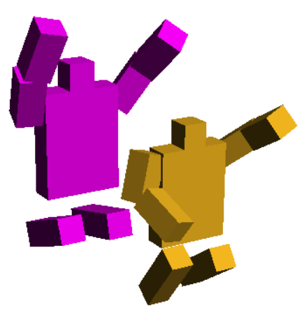

# leap
A maze demo in Racket Scheme.

Leap is a maze simulator that I used to explore pathfinding and developing a job/task system. You can see the development progress in the [dev diary](https://donomii.github.io/leapingFigures)

