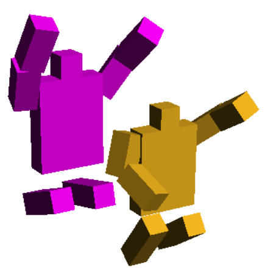
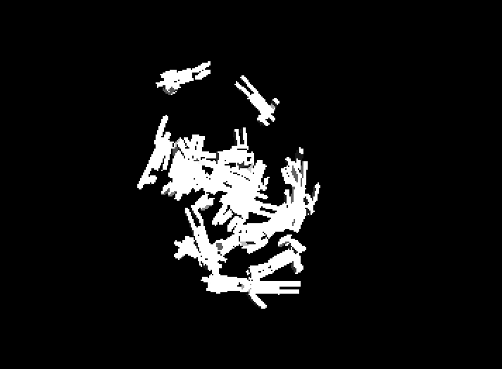
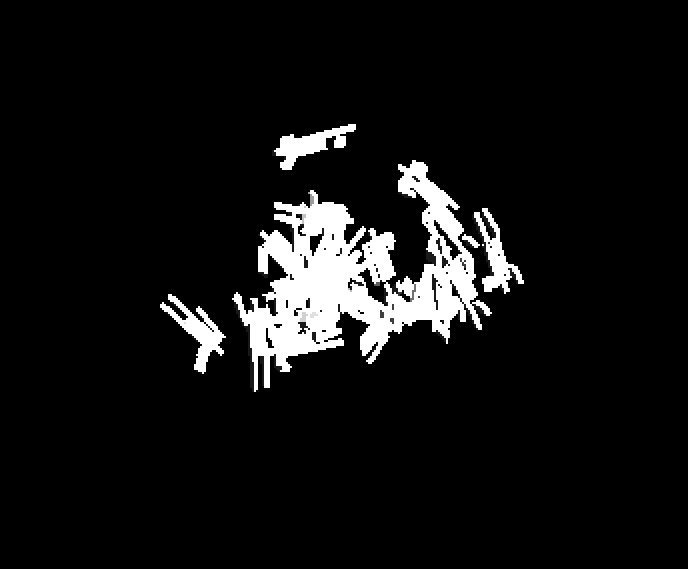

# The start

Well, almost the start.  This is the development diary for my little project, a “colony simulator” written in a version of scheme called [PLT Racket](http://rosettacode.org/wiki/A*_search_algorithm#Racket).

I learned Racket a while ago, while it was still called PLT Scheme, and wrote a few simple things in it, including the start of a procedural generation system.  As part of that, I created these little guys.

They hung around on my [website](http://praeceptamachinae.com/) for years, until I got the urge one day to finally make a quick little game with them.  So let's do that now.

## Get something on screen

Let’s start by getting some figures on screen.

Looks like I’m rotating around the wrong axis there.  I like the look though, I’ll have to add this effect deliberately later.  It reminds me of [this illustration](https://commons.wikimedia.org/wiki/File:Paradiso_Canto_31.jpg).

## Walking on a plane

A few vector tweaks later and I have my little figures marching around on an invisible surface.

<embed src="walkingbackwards.mov" width="400" height="480" controller="true">

Now I just have to get them pointed in the right direction…

<embed src="swimming.mov" width="400" height="480" controller="true">

Oh dear.

## Doing something

Now that I can draw my figures on the screen, I should convince them to do something.  To start with, I command them to walk from place to place.  Since this is scheme, all the commands will also look like scheme

    (moveTo 10 10)
	
which will cause a figure to walk from their current location to 10,10 on the map.  It's a simple, easy to understand system that will cause vast amounts of bother and confusion for the rest of the project.

Each worker has one job, and when they finish the lie down and rest.  So I can now make them run around like little ping pong balls, bouncing from place to place, which amuses me.

## Great potential

All this is enough to encourage me to continue the project.  It's a good result for a couple of hours work, and I can see lots of places to improve things already.

